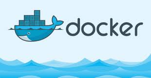
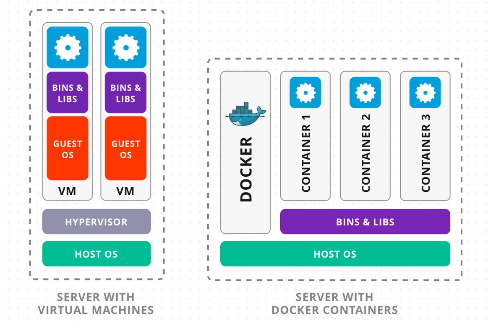
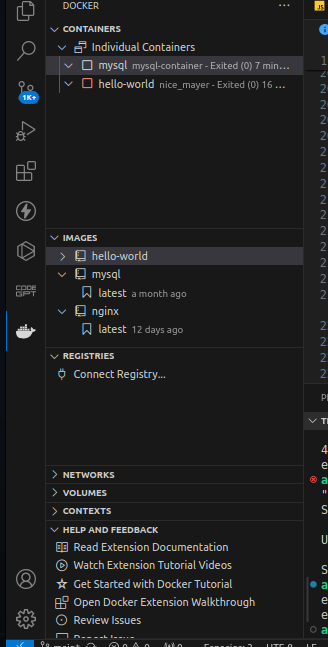
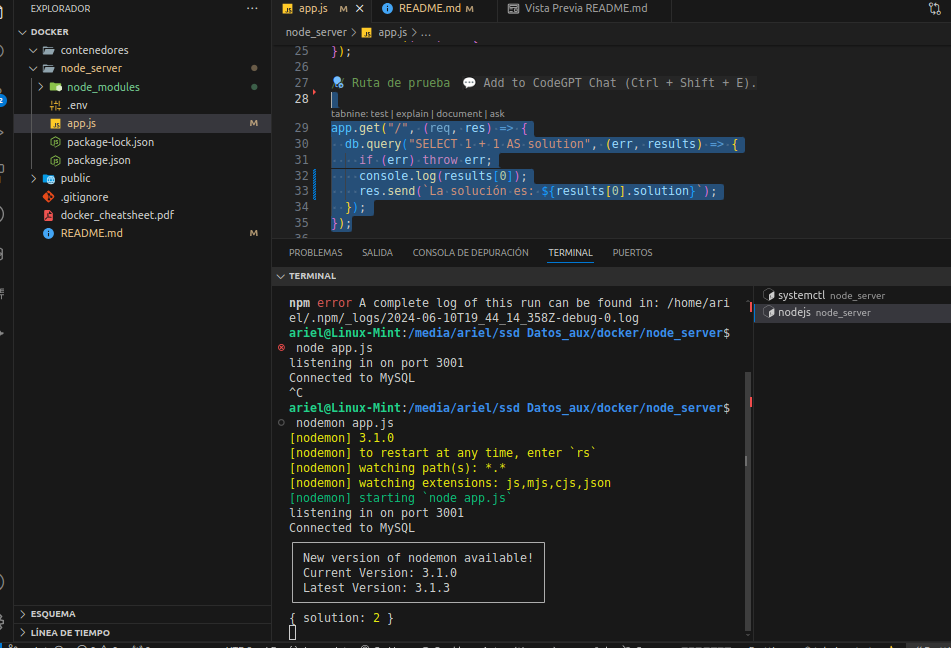
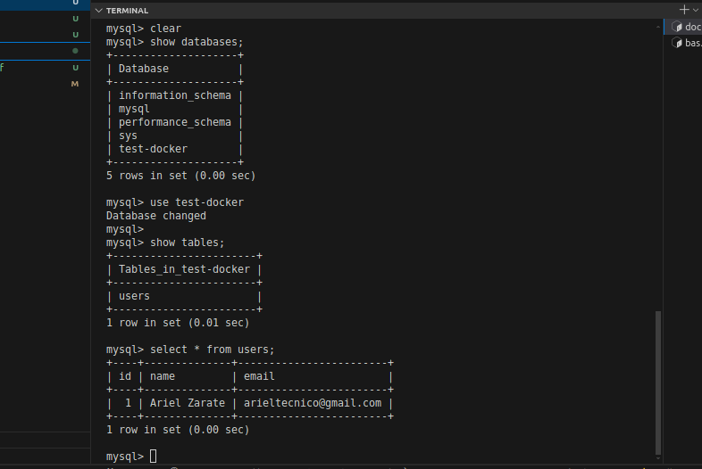

# Docker



Docker es una plataforma de código abierto que permite a los desarrolladores automatizar el despliegue, escalado y administración de aplicaciones dentro de contenedores. Un contenedor es una unidad de software que empaqueta el código de una aplicación junto con todas sus dependencias, librerías y configuraciones necesarias para que pueda ejecutarse de manera consistente en cualquier entorno.

## Características principales de Docker:

- Portabilidad: Los contenedores pueden ejecutarse en cualquier sistema que tenga Docker instalado, independientemente del entorno subyacente (Linux, Windows, etc.). Esto facilita la transferencia de aplicaciones entre diferentes entornos de desarrollo, pruebas y producción sin que haya problemas de compatibilidad.

- Aislamiento: Cada contenedor se ejecuta en un entorno aislado, lo que significa que no interfieren entre sí. Esto mejora la seguridad y permite ejecutar múltiples aplicaciones en el mismo host sin conflictos.

- Ligereza: Los contenedores son más ligeros que las máquinas virtuales porque comparten el mismo sistema operativo base y solo contienen lo necesario para ejecutar la aplicación. Esto permite un uso más eficiente de los recursos del sistema.

- Escalabilidad: Docker facilita el escalado de aplicaciones mediante la creación rápida de múltiples instancias de contenedores, lo cual es ideal para arquitecturas de microservicios y aplicaciones distribuidas.

- Eficiencia en el desarrollo y despliegue: Docker permite a los desarrolladores crear entornos de desarrollo replicables que coinciden con los entornos de producción, lo que reduce los problemas de "funciona en mi máquina" y acelera el ciclo de desarrollo.



<hr/>

## Componentes de Docker:

- Docker Engine: Es el motor de Docker, una aplicación cliente-servidor que comprende un demonio de larga ejecución (dockerd), una API REST que especifica interfaces que los programas pueden usar para hablar con el demonio, y una interfaz de línea de comandos (docker).

- Docker Hub: Es un servicio en la nube de Docker que permite almacenar y distribuir imágenes de contenedores. Los desarrolladores pueden compartir imágenes de sus aplicaciones y usar imágenes base públicas o de terceros.

- Docker Compose: Una herramienta para definir y ejecutar aplicaciones Docker multi-contenedor. Con un archivo YAML, los usuarios pueden especificar los servicios, redes y volúmenes necesarios para la aplicación.

- Docker Swarm: Es el orquestador nativo de Docker para la administración y escalado de contenedores. Permite agrupar múltiples instancias de Docker en un clúster, coordinando los contenedores distribuidos en los nodos del clúster.

En resumen, Docker es una tecnología que ha revolucionado el desarrollo y despliegue de software al proporcionar una manera eficiente, reproducible y escalable de gestionar aplicaciones mediante contenedores.

## Usos de Docker

Docker puede ser utilizado para una amplia variedad de casos en el desarrollo y despliegue de software. Aquí tienes algunas de las aplicaciones más comunes:

1. Desarrollo de Software
   Entornos de Desarrollo Consistentes: Docker permite crear un entorno de desarrollo que es idéntico al de producción, eliminando el problema de "funciona en mi máquina". Los desarrolladores pueden compartir configuraciones de Docker con sus equipos para asegurarse de que todos trabajen en un entorno uniforme.
   Aislamiento de Dependencias: Cada contenedor puede tener sus propias dependencias y librerías, evitando conflictos con otras aplicaciones.
2. Despliegue y Escalabilidad
   Despliegue Continuo: Docker facilita la integración y despliegue continuo (CI/CD). Las imágenes Docker pueden ser construidas y probadas automáticamente, y luego desplegadas en producción sin necesidad de configuraciones adicionales.
   Escalabilidad Fácil: Con Docker, puedes escalar rápidamente tu aplicación creando múltiples instancias de contenedores y balanceando la carga entre ellos. Esto es especialmente útil para aplicaciones basadas en microservicios.
3. Microservicios
   División de Aplicaciones Monolíticas: Docker es ideal para dividir aplicaciones monolíticas en microservicios, permitiendo a los equipos trabajar en diferentes componentes de la aplicación de manera independiente.
   Despliegue Independiente: Cada microservicio puede ser desplegado, escalado y actualizado independientemente de los demás.
4. Pruebas y QA
   Pruebas Automatizadas: Docker permite ejecutar pruebas automatizadas en un entorno controlado. Puedes crear contenedores efímeros para pruebas que se destruyen una vez completadas, asegurando que cada prueba se realice en un entorno limpio.
   Entornos de Pruebas Reproducibles: Facilita la creación de entornos de prueba que son consistentes y reproducibles, reduciendo la variabilidad en los resultados de las pruebas.
5. Aplicaciones Legacy
   Migración a Nuevas Infraestructuras: Docker permite encapsular aplicaciones legacy en contenedores, facilitando su migración a nuevas infraestructuras sin necesidad de modificar el código.
6. Desarrollo y Pruebas en la Nube
   Plataformas en la Nube: Docker es compatible con muchas plataformas de nube como AWS, Azure y Google Cloud. Puedes desarrollar y probar aplicaciones localmente en Docker y luego desplegarlas en la nube con mínima configuración adicional.
   Entornos Multi-Cloud: Facilita el despliegue de aplicaciones en múltiples proveedores de nube, ofreciendo flexibilidad y evitando el vendor lock-in.
7. Big Data y Machine Learning
   Contenedores para Análisis de Datos: Docker puede ser utilizado para crear entornos de análisis de datos con herramientas específicas, facilitando la replicación de entornos complejos.
   Modelos de Machine Learning: Los modelos de machine learning pueden ser empaquetados junto con sus dependencias en contenedores, asegurando que se ejecuten de manera consistente en cualquier entorno.
8. Educación y Experimentación
   Entornos de Aprendizaje: Docker es una excelente herramienta para crear entornos de aprendizaje y experimentación, permitiendo a los estudiantes y profesionales probar nuevas tecnologías y configuraciones sin riesgo de dañar su sistema principal.
9. Seguridad
   Aislamiento de Aplicaciones: Docker proporciona un nivel de aislamiento para las aplicaciones, mejorando la seguridad al limitar el impacto de vulnerabilidades y exploits a un contenedor específico.
   En resumen, Docker es una herramienta muy versátil que puede ser utilizada para mejorar la consistencia, escalabilidad, eficiencia y seguridad en el desarrollo y despliegue de aplicaciones.

## Instalacion de Docker

La instalación de Docker puede variar según el sistema operativo que estés utilizando. A continuación, te proporciono una guía para instalar Docker en los sistemas operativos más comunes: Ubuntu, Windows y macOS.

### Instalación de Docker en Ubuntu / Debian / Mint

(este es mi caso) Tenga en cuenta que generalmente usar linea de comandos

1. Actualizar el índice de paquetes apt:

```bash
sudo apt-get update

```

2. Agregar el repositorio de Docker:

```bash
curl -fsSL https://download.docker.com/linux/ubuntu/gpg | sudo gpg --dearmor -o /etc/apt/keyrings/docker.gpg
sudo chmod a+r /etc/apt/keyrings/docker.gpg
```

3. Actualizar el índice de paquetes apt de nuevo:

```bash
 sudo apt-get update
```

4. Instalar Docker

```bash
sudo  apt install docker.io
  o descargar el archivo .deb d ela pagina
```

5. Verificar la instalacion:

```bash
 docker --version

```

8. (opcional) Añadir tu usuario al grupo de docker:

```bash
sudo usermod -aG docker ${USER}

```

Nota: Debes cerrar sesión y volver a iniciarla para que los cambios tengan efecto.

### Instalación de Docker en Windows

1. Descargar Docker Desktop:

- Ve a la página de Docker `https://www.docker.com/get-started/` y descarga el instalador para Windows.

2. Ejecutar el instalador:

- Ejecuta el archivo descargado y sigue las instrucciones del asistente de instalación.

3. Reiniciar el sistema:

- Es posible que se te solicite reiniciar el sistema durante el proceso de instalación.

4. Iniciar Docker Desktop:

- Después de la instalación, inicia Docker Desktop desde el menú de inicio.

### Verificar la instalación:

Ejecuta una terminal powershell y ejecuta

```bash
docker --version

```

## Cómo gestionar el inicio automático de Docker

En Linux (usando systemd)
Puedes habilitar o deshabilitar el inicio automático de Docker usando systemctl:

Para habilitar el inicio automático:

```bash
sudo systemctl enable docker
```

Para deshabilitar el inicio automático:

```bash
sudo systemctl disable docker
```

## Ejecutar tu primer contenedor

Vamos a ejecutar un contenedor simple utilizando la imagen de hello-world. Esta imagen está diseñada para verificar que Docker esté funcionando correctamente:

```bash
docker run hello-world
```

## comandos básicos de Docker

Familiarízate con algunos de los comandos básicos de Docker:

Listar contenedores activos:

```bash
docker ps
```

Listar todos los contenedores (activos e inactivos):

```bash
docker ps -a
```

Listar imágenes descargadas:

```bash
docker images
```

Arrancar un contenedor:

```bash
docker start <container_id> o su name
```

Detener un contenedor:

```bash
docker stop <container_id>
```

Eliminar un contenedor:

```bash
docker rm <container_id>
```

Reiniciar un Contenedor:

```bash
docker restart mysql-container

```

Eliminar una imagen:

```bash
docker rmi <image_id>
```

## Dependencias en vsc

Puede descargar una dependencia de vsc llamada `docker` de microsoft
Con ella se puede arrancar , eliminar , inspeccionar un contenedor.
Ademas los contenedoresa activos aparecen en la ventana , es una forma grafica sino le gusta la linea de comandos


## Docker Hub

Para crear un contenedor en Docker, primero necesitas una imagen de Docker. Una imagen es una plantilla que contiene todos los archivos y configuraciones necesarios para ejecutar un contenedor.

Puedes crear un contenedor en Docker utilizando el comando docker run. Aquí tienes los pasos básicos para crear un contenedor:

vamos a descragr una imagen desde docker git hub nuestro ejemplo mysql


ejecutamos en el shell e instalamos la imagen de mysql

```bash
docker pull mysql

```

# 1 Creando un servidor de docker para ejecutar mysql con Node

### Estructura

```bash

node-server/
│
├── package.json
├── package-lock.json
└── app.js
```

### 1.1 crear contenedor con MYSQL

```bash
 docker run --name mysql-container -e MYSQL_ROOT_PASSWORD=admin -e MYSQL_DATABASE=test-docker -p 3307:3306 -d mysql

```

Desglose del Comando `docker run`:

- Este es el comando básico para ejecutar un nuevo contenedor.
  `--name mysql-container` :
  `--name` es una opción que permite asignar un nombre específico al contenedor como `mysql-container`

- `-e MYSQL_ROOT_PASSWORD=password` :
  `-e` es una opción para establecer variables de entorno dentro del contenedor.
  `MYSQL_ROOT_PASSWORD`=12345 establece la contraseña para el usuario root de MySQL a `password`.

- `-e MYSQL_DATABASE=testdb`: MYSQL_DATABASE=testdb es otra variable de entorno que instruye a MySQL
  para crear una base de datos llamada testdb al iniciar el contenedor.

- Establecendo el puerto con `-p 3307:3306 `

  `-p` es una opción para mapear puertos del contenedor a puertos de tu máquina anfitriona.
  3307:3306 significa que el puerto 3306 en tu máquina anfitriona (la máquina donde se está ejecutando Docker) se mapeará al puerto `3307` del contenedor. El puerto 3306 es el puerto por defecto en el que MySQL.

- Ejecutar el contenedor en segundo plano `-d`
  `-d` es una opción para ejecutar el contenedor en modo desapegado (detached). Esto significa que el contenedor se ejecutará en segundo plano y no bloqueará tu terminal.

- mysql:5.7 o solamente `mysql`.
  Esta es la imagen de Docker que se utilizará para crear el contenedor. En este caso, se está usando la imagen oficial de MySQL en su versión 5.7.

### 1.2 crear contenedor con POSTGRES (opcion 2)

En el mismo archivo `app.js `

```bash

node-server/
│
├── package.json
├── package-lock.json
└── app.js
```

```bash
docker run --name postgres-container  -e POSTGRES_PASSWORD=admin  -e POSTGRES_DB=db -p 5432:5432 -d postgres

```

- puede modificar el nombre , el puerto y el password que ud quiera

- no se puede monitorear el estado de postgres dentro del contenedor como se hace con mysql con systemctl status

- la opción es utilizar el comando pg_isready para verificar si el servidor PostgreSQL está listo para aceptar conexiones.

```bash
 docker exec mi_postgres pg_isready
```

<hr/>

# 2 creamos en servidor de nodejs

Estructura

```bash
docker-nodejs/
│
├── src/
│   ├── controller/
│   │   └── user.js
│   ├── routes/
│   │   └── user.js
│   └── app.js
│
├── package.json
└── package-lock.json


```

Creamos una folder llamada node_server. Y adentro ejecutamos el siguiente comando

```bash
npm init -y
```

creamos el package.json , luego instalamos dependencies

- npm i express
- npm i mysql2
- npm i nodemon

```javascript
const express = require("express");
const mysql = require("mysql2");
const app = express();

const router = express.Router();
const PORT = 3001;
app.name = "server Node con docker";

// Configuración de la conexión a MySQL
const db = mysql.createConnection({
  host: "localhost",
  user: "root",
  password: "admin",
  database: "test-docker",
  port: "3307",
});

// Conectar a MySQL
db.connect((err) => {
  if (err) {
    console.error("Error connecting to MySQL:", err);
    return;
  }
  console.log("Connected to MySQL VIVA LA LIBERTAD 🗽");
});

//ruta de prueba en el nevegador
app.get("/", (req, res) => {
  db.query("SELECT 1 + 1 AS solution", (err, results) => {
    if (err) throw err;
    //por consola
    console.log(results[0]);
    res.send(`La solución es: ${results[0].solution}`);
  });
});

//iniciando el server mensaje de salida
app.listen(PORT, () => {
  console.log(`listening in on port ${PORT} `);
});
```

Con esto creado estaria listo el sevidor de node con express y conectado con mysql

El ejecutar `node app.js` o `nodemon app.js` se ejecutara el servidor y se conectara con la bd de mysql configurada en `docker`




<hr/>

# Opcion Extra conectarse a mysql desde el contenedor

Una vez levantado el contenedor tambien podemos acceder a el y entrar con mysql para ejecutar comandos mysql desde consola 😀

## Paso 1: Acceder al contenedor

Primero, necesitas acceder al contenedor en ejecución. Puedes hacerlo utilizando el comando docker exec para ejecutar comandos dentro de un contenedor en ejecución.

```bash
docker exec -it mysql-container bash
```

En este comando:

- docker exec ejecuta un nuevo comando en un contenedor en ejecución.
- -it permite la interacción con la terminal (-i para interactivo y -t para asignar una pseudo-TTY).
- mysql-container es el nombre del contenedor en el que deseas ejecutar el comando.
- bash es el comando que deseas ejecutar, en este caso, una terminal bash.

## Paso 2: Conectarse a MySQL desde la terminal del contenedor

Una vez dentro del contenedor, puedes conectarte a MySQL usando el cliente MySQL.

```bash
mysql -u root -p
```

Le pedira password ud ingrese la que haya creado con el contenedor (en mi caso admin)

### Paso 3: Realizar consultas MySQL

Una vez conectado a MySQL, puedes realizar cualquier consulta SQL como lo harías en una instalación normal de MySQL. Aquí hay algunos ejemplos:
Ver todas las bases de datos:

```bash
SHOW DATABASES;
```

Usar una base de datos específica:

```bash
USE test-docker;
```

Ver todas las tablas en la base de datos actual:

```bash
SHOW TABLES;
```

Crear una tabla de ejemplo:

```bash
CREATE TABLE users (
id INT AUTO_INCREMENT PRIMARY KEY,
name VARCHAR(255) NOT NULL,
email VARCHAR(255) NOT NULL
);
```

Insertar datos en una tabla:

```bash
INSERT INTO users (name, email) VALUES ('John Doe', 'john@example.com');
```

Seleccionar datos de una tabla:

```bash
SELECT \* FROM users;
```

Esta es una forma de realizar consultas MySQL directamente dentro del contenedor. Puedes utilizar cualquier comando SQL que necesites una vez que estés conectado a la base de datos.



## Conectarse postgres desde el contenedor

1.  Acceder al contenedor

```bash
docker exec -it postgres-container  bash
```

3. acceder a postgresql

```bash
psql -U postgres
```

2.  Ver base de datos

```bash
psql -U postgres -c '\l'
```

Dentro del cliente psql, puedes ejecutar una variedad de comandos para interactuar con el servidor PostgreSQL, administrar bases de datos, tablas, usuarios y más. Aquí tienes una lista de algunos de los comandos más comunes que puedes usar:

```bash
\l: Lista todas las bases de datos disponibles.

\c dbname: Conecta a una base de datos específica.

\dt: Lista todas las tablas en la base de datos actual.

\d table_name: Describe la estructura de una tabla específica.

\du: Lista todos los roles de usuario (usuarios).

\q: Sale del cliente psql.

\h: Muestra la lista de comandos SQL disponibles.

\conninfo: Muestra información sobre la conexión actual.

\timing: Activa o desactiva el cronometraje de las consultas.

\df: Lista todas las funciones definidas en la base de datos.

\dv: Lista todas las vistas definidas en la base de datos.

\copyright: Muestra información de derechos de autor.

\password: Cambia la contraseña del usuario actual.

\x: Activa o desactiva el modo de salida expandida.

CREATE DATABASE my_database;


//ejemplo creado

CREATE DATABASE pet;
\c pet
CREATE TABLE animals (
    id SERIAL PRIMARY KEY,
    name VARCHAR(100),
    species VARCHAR(100)
);
INSERT INTO animals (name, species) VALUES ('Max', 'Dog');
INSERT INTO animals (name, species) VALUES ('Whiskers', 'Cat');
INSERT INTO animals (name, species) VALUES ('Tweety', 'Bird');
SELECT * FROM animals;
\q


```

# DOCKERFILE

En esta 2da parte ya mostrare como se usa le dockerFile y otros archivos

## DockerFile

Un Dockerfile es un archivo de texto plano que define la configuración de una única imagen de contenedor.
Especifica cómo se construye una imagen de contenedor, qué dependencias se instalan, qué archivos se copian dentro del contenedor y cómo se configura el entorno dentro del contenedor.
Es útil para definir y construir la configuración específica de un único contenedor, por ejemplo, la imagen de un servidor web, una aplicación Node.js, una base de datos, etc.
este archivo podemos dejar descripto el paso a paso.
Muchas veces en nuestro proyecto trabajaran otras personas que no usan nuestras tecnologias por lo tanto utilizando docker un contenedor y usando un DockerFile le diremos a docker que descargue una imagen , que cree un contenedor paar esa imagen y que ejecute de la forma descripta , y todo ese con solo dos comandos, ademas solo se instala en el contenedor NO ESTA EN EL SISTEMA OPERATIVO POR LO TANTO CUANDO SE ELIMINA EL CONTENEDOR SE ELIMINA TODOS LOS PROGRAMAS QUE ESTABAN ADENTRO! 😀

### Estructura

```bash

node-dockerfile/
│
├── Dockerfile
├── package.json
├── package-lock.json
└── src/
└── index.js
```

### crear servidor

1. Dentro de una folder en mi caso node-dockerfile ejecutamos `npm init -y` esto creara un package.json
2. instalamos las dependencias `npm  i express nodemon`
3. Creamos un archivo app.js que sera el `server`

```javascript
const express = require("express");
const app = express();
const port = 4000;

app.get("/", (req, res) => {
  res.json("Hello World!");
});

app.listen(port, () => {
  console.log(`Servidor escuchando en http://localhost:${port}`);
});
```

En el package.json creo un script

```javascript
{
  "name": "dockerfile",
  "version": "1.0.0",
  "main": "app.js",
  "author": "Ariel Zarate",
  "scripts": {
    "start": "node app.js",
    "dev": "nodemon app.js"
  },
  "keywords": [],
  "license": "ISC",
  "description": "",
  "dependencies": {
    "express": "^4.19.2",
    "nodemon": "^3.1.3"
  }
}


```

### creando dockefile

##### Aquí hay una descripción general de algunas instrucciones comunes que puedes encontrar en un Dockerfile:

1.  FROM: Esta es la primera instrucción que debe aparecer en un Dockerfile. Indica la imagen base que se utilizará para construir tu imagen. Por ejemplo, puedes usar FROM node:14 para utilizar una imagen de Node.js versión 14 como base.

2.  COPY / ADD: Estas instrucciones copian archivos desde tu sistema de archivos local al sistema de archivos del contenedor. Por ejemplo, COPY package.json /app copiará el archivo package.json desde el directorio actual al directorio /app dentro del contenedor.

3.  RUN: Esta instrucción ejecuta comandos en el contenedor durante el proceso de construcción. Por ejemplo, puedes usar RUN npm install para instalar las dependencias de tu aplicación.

4.  WORKDIR: Esta instrucción establece el directorio de trabajo dentro del contenedor. Es el directorio desde el cual se ejecutarán todos los comandos RUN, CMD y ENTRYPOINT. Por ejemplo, WORKDIR /app establecerá /app como el directorio de trabajo.

5.  CMD / ENTRYPOINT: Estas instrucciones especifican el comando que se ejecutará cuando el contenedor se inicie. Puedes usar CMD para especificar un comando que se ejecutará por defecto cuando se inicie el contenedor, mientras que ENTRYPOINT especifica un comando que se ejecutará siempre y cuando se pueda reemplazar con otros comandos al iniciar el contenedor.

Estas son solo algunas de las instrucciones comunes que puedes encontrar en un Dockerfile. Dependiendo de tus necesidades específicas, puedes encontrar otras instrucciones que se ajusten mejor a tu caso de uso. En general, un Dockerfile es la piedra angular para construir imágenes de contenedor personalizadas que contienen tu aplicación y todos los componentes necesarios para que se ejecute correctamente dentro de un entorno Docker.

Ahora cremos el un archivo `dockerfile` sin extension

```bash

#configuracion de archivo dockerfile

# usar una imagen de nodejs

FROM node:18-alpine

# Establecer el directorio de travajo dentro del contenedor

WORKDIR /app


## copiar en el package.json

COPY  package*.json ./

# Instalar las dependecias

 RUN npm install

 # Copiar el resto del codigo de la aplicacion

 COPY . .


 # Exponer el puesto en el que la aplicacion  correra

 EXPOSE  4000


# Comando para ejecutar la aplicacion

CMD ["npx","nodemon", "app.js"]

```

### contruir imagen

Ejecutamos

```bash
docker build -t app-node .

```

### Ejecutar contenedor de imagen

```bash
docker run  -p 4001:4000 app-node
```

con eso ya tenemos creado el contenedor y se esta ejecutando ,podemos ejecutar

- docker ps -a
- docker stop <nombre_container o id>
- docker start <nombre_del_contenedor_o_ID> #solo ejecuta el contenedor pero no crea nada , en cambio al hacer run crea uno nuevo!!
- docker restart <nombre_del_contenedor_o_ID>
- docker rm <nombre_del_contenedor_o_ID> #elimina el contenedor
- docker logs <nombre_del_contenedor_o_ID>
- docker stats # muestra todos los recursos que consume el contenedor
- docker stop $(docker ps -q) # Detener todos los contenedores en ejecución

## Docker Compose:

Docker Compose es una herramienta que permite definir y ejecutar aplicaciones compuestas por múltiples contenedores.
Utiliza un archivo YAML (docker-compose.yml) para definir los servicios que componen la aplicación, incluyendo la configuración de cada servicio, las dependencias entre ellos y cómo se comunican.
Es útil para orquestar y gestionar múltiples contenedores como una aplicación única, simplificando el proceso de desarrollo, prueba y despliegue de aplicaciones que requieren varios servicios.
Proporciona comandos para gestionar fácilmente los contenedores definidos en el archivo docker-compose.yml, como iniciarlos, detenerlos, ver sus registros, etc.
En resumen, mientras que un Dockerfile se utiliza para definir la configuración de una sola imagen de contenedor, Docker Compose se utiliza para definir la arquitectura de una aplicación compuesta por múltiples contenedores, simplificando la gestión y orquestación de esos contenedores como una aplicación única.

#### Instalación

Para instalar docker-compose, primero necesitamos tener instalada la herramienta Docker en nuestro sistema. Después, en Ubuntu, ejecutamos el siguiente comando:

```bash
sudo apt install docker-compose
```

## Proyecto docker-compose

Estructura

```bash
docker-compose/
│
├── docker-compose.yml
├── .env
├── lib/
│   └── config.js
└── app.js

```

Dependencias

- "dotenv": "^16.4.5",
- "express": "^4.19.2",
- "morgan": "^1.10.0",
- "pg": "^8.12.0",
- "sequelize": "^6.37.3"

### Docker-Compose.yml

```bash
version: "3.8"

services:
  db:
    image: postgres:latest
    restart: always
    container_name: postgres-container
    environment:
      POSTGRES_DB: postgres
      POSTGRES_USER: postgres
      POSTGRES_PASSWORD: admin
    ports:
      - "5432:5432"
    volumes:
      - /var/lib/postgresql/data

```

### config.js

```javascript
const { Sequelize } = require("sequelize");

const DATABASE = process.env.POSTGRES_DB;
const USER = process.env.POSTGRES_USER;
const PASSWORD = process.env.POSTGRES_PASSWORD;

//ESTOS SON LOS DATOS CONFIGURADOS EN EL DOCKER-COMPOSE
const sequelize = new Sequelize(DATABASE, USER, PASSWORD, {
  host: "localhost",
  dialect: "postgres",
  port: 5432,
});

module.exports = sequelize;
```

### .env

```bash
  |
  #variables de docker
      POSTGRES_DB= postgres
      POSTGRES_USER= postgres
      POSTGRES_PASSWORD= admin
```

### creando server con nodejs

```javascript
const express = require("express");
const dotenv = require("dotenv");
dotenv.config();

const morgan = require("morgan");
const sequelize = require("./lib/config");

const app = express();
app.use(express.json());
app.use(morgan("dev"));

//ruta test

app.get("/", (req, res) => {
  res.json("Hello World!");
});

//funcion que ejecuta el server
async function Start() {
  try {
    await sequelize.authenticate();
    console.log("Conectado a la base de datos");

    //  .then((seq) => seq.sync({ force: true }));
    app.listen(3000, async () => {
      console.log("listening on port 3000...");
    });
  } catch (error) {
    console.error("No se pudo conectar a la base de datos:", error);
  }
}

Start();
```

#### opcion 2: creando contendedor de nodejs

1. bajar imagen de node `docker pull node`
2. Ejecutar `docker run -p 3000:3000 --name docker-node -d node`
   `
